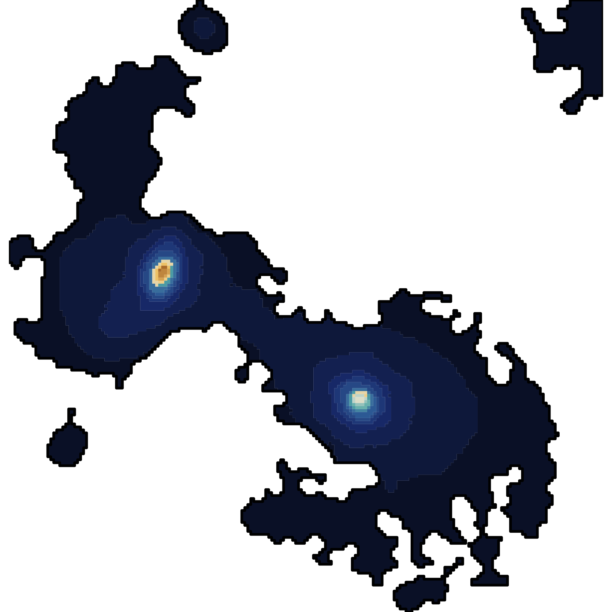

This page shows how `saguiSED` is used after the segmentation step. The input is
a regional photometry table: one row per region and one flux/error pair per
filter.

## Common setup

```r
suppressPackageStartupMessages({
  library(sagui)
  library(saguiSED)
  library(ggplot2)
})

sagui_palette <- c("#213E60", "#94B6EF", "#F4F2EF", "#E68C3A")
```

## From sagui to saguiSED

Run the segmentation in `sagui`, then extract flux-conserving regional SEDs.

::: {.image-card .medium-image}

:::

```r
seg <- segment_regions(
  input = cube,
  Ncomp = 20,
  use_starlet_mask = TRUE,
  starlet_J = 5,
  starlet_scales = 2:5
)

regional_seds <- extract_region_sed(
  cube = cube,
  labels = seg$cluster_map,
  band_values = band_wavelengths,
  error_fallback = "mad_sky"
)
```

The summed regional flux is the SED-fitting input. Mean SEDs can be useful as
diagnostics, but the summed table preserves total flux.

```r
utils::write.csv(
  regional_seds$flux_wide,
  "region_seds_wide.csv",
  row.names = FALSE
)
```

## Filter sets

For JWST/NIRCam photometry, use the NIRCam response curves bundled with
`sagui`.

```r
filters <- jwst_nircam_filter_set()
```

For Rubin/LSST-style photometry, use the response curves bundled with
`saguiSED`.

```r
filters <- lsst_filter_set()
```

Custom filter curves are accepted through `sed_filter_set()`.

```r
filters <- sed_filter_set(
  throughput = "my_filter_curves.csv",
  filters = c("F090W", "F115W", "F150W", "F200W"),
  name = "custom",
  wavelength_unit = "micron"
)
```

The throughput table must contain a filter name, wavelength, and throughput
column. Additional effective-wavelength columns can be supplied when available.

## Fitting regional SEDs

Convert the wide table and call the backend.

```r
sed <- as_sagui_sed_table(
  "region_seds_wide.csv",
  filter_set = filters,
  unit = "10nJy",
  redshift = 1.10,
  n_pix_col = "n_pix"
)

fit <- fit_region_seds(
  sed,
  backend = "bagpipes",
  model = bagpipes_model(
    sfh = "exponential",
    dust = "calzetti",
    metallicity = "free",
    systematic_frac = 0.10
  ),
  out_dir = "bagpipes_region_fits"
)
```

The fit object contains:

```r
names(fit)
```

- `summary`: one row per fitted region.
- `model_photometry`: observed and model photometry per filter.
- `model_spectrum`: model spectrum returned by the backend, when available.
- `filter_set`: the response curves used by the backend.

## SED fit panels

```r
plot_sed_fit_mosaic(
  fit,
  normalize = "none",
  ncol = 4,
  transmission_height = 0.2,
  point_size = 2.8,
  base_size = 12
)
```

Filter points are colored by wavelength. The model line is kept visually
separate from the observed photometry so the plot remains readable on the
website and in notebooks.

::: {.image-card .wide-image}

:::

## Property maps

Paint fitted region summaries back to the image plane:

::: {.image-card .medium-image}

:::

```r
maps <- paint_sed_properties(
  seg$cluster_map,
  fit,
  properties = c("logMformed", "logSFR", "logsSFRformed", "age_gyr", "logZ_Zsun", "Av")
)

save_sed_property_map_pngs(
  maps,
  out_dir = "property_maps_png",
  prefix = "example"
)

write_property_maps(
  maps,
  out_dir = "property_maps_fits",
  prefix = "example"
)

write_property_cube(
  maps,
  path = "example_property_cube.fits"
)
```

The FITS cube is useful for opening several derived quantities in tools such as
SAOImageDS9. The CSV manifest records which property is stored in each plane.

## Regularized maps

Independent region fits are the primary result. For map-level interpretation,
`saguiSED` can also smooth fitted quantities on the region-adjacency graph.

```r
maps_smooth <- smooth_sed_property_maps(
  seg$cluster_map,
  fit,
  lambda = 3,
  adjacency = "queen",
  unsmoothed_properties = "fit_rms_sigma"
)

save_sed_property_map_pngs(
  maps_smooth,
  out_dir = "property_maps_smooth_png",
  prefix = "example"
)

write_property_cube(
  maps_smooth,
  path = "example_property_cube_smooth.fits"
)
```

This is a post-processing estimator. It does not refit the photometry and does
not change the independent Bagpipes summaries.

::: {.image-card .medium-image}

:::

## Units

`as_sagui_sed_table()` currently supports:

- `Jy`
- `uJy`
- `nJy`
- `10nJy`

Use the unit that matches the regional table. If the image cube is stored in
`10 nJy`, pass `unit = "10nJy"` rather than converting manually.
