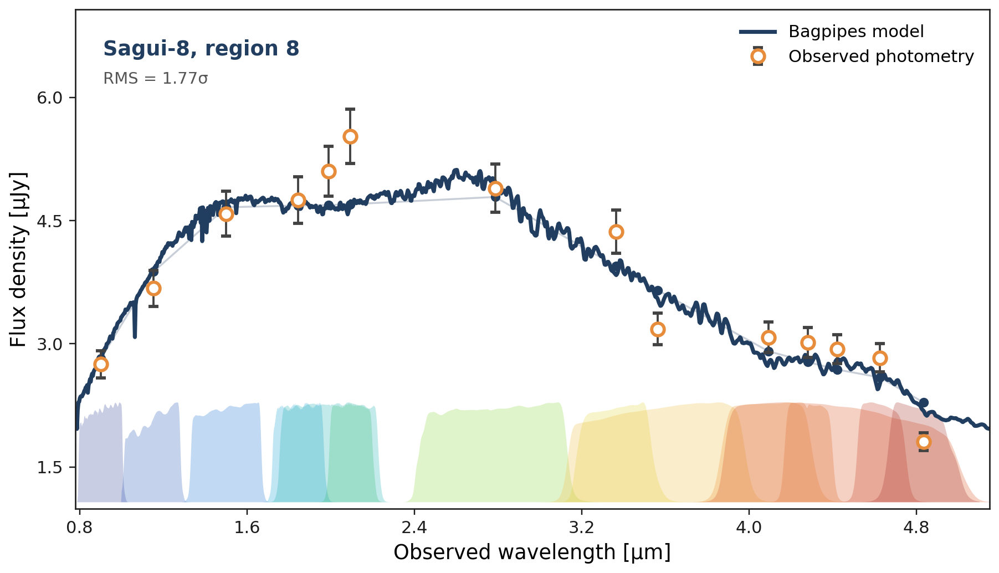
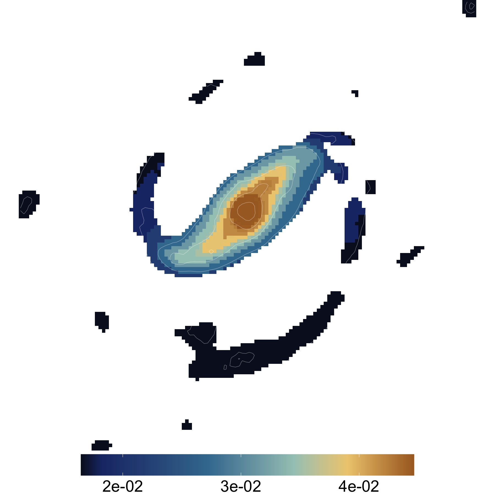

```{=html}
<section class="hero-brand">
  <div class="hero-brand-copy">
    <div class="hero-kicker">SED fitting for segmented photometry</div>
    <div class="hero-title">saguiSED</div>
    <div class="hero-copy">
      Fit region-integrated photometric SEDs produced by <code>sagui</code>,
      then paint physical-property summaries back onto the segmentation map.
      Heavy SED-fitting dependencies stay outside the core segmentation package.
    </div>
    <div class="hero-actions">
      <a class="hero-button hero-button-primary" href="#quick-start">Quick start</a>
      <a class="hero-button" href="examples.html">Workflows</a>
      <a class="hero-button" href="backends.html">Backends</a>
      <a class="hero-button" href="https://github.com/RafaelSdeSouza/saguiSED">GitHub</a>
    </div>
  </div>
  <div class="hero-visuals">
    <div class="hero-visual-card">
      
    </div>
    <div class="hero-affiliation">
      
      <span>Part of the <strong>COIN Toolbox</strong></span>
    </div>
  </div>
</section>
```

## What saguiSED does

`saguiSED` is a companion package for the photometric SED-fitting stage of a
segmented-galaxy workflow. The core `sagui` package decides how pixels are
grouped and exports flux-conserving regional SEDs. `saguiSED` starts from those
regional SED tables.

::: {.feature-grid}
::: {.feature-card}
### 1. Read regional photometry

Convert a `sagui` regional SED table, or a compatible CSV, into a
`sagui_sed_table`.
:::

::: {.feature-card}
### 2. Fit region SEDs

Call an optional backend, currently Bagpipes, while keeping Python dependencies
outside the core segmentation package.
:::

::: {.feature-card}
### 3. Paint maps

Paint fitted physical quantities back onto the segmentation map and optionally
regularize them on the region-adjacency graph.
:::
:::

## Showcase

The figures below show the intended output style: a regional SED fit, a
segmentation map used as spatial support, and a fitted quantity painted back to
the image plane.

::: {.gallery-grid}
::: {.output-card}


**Regional SED fit**
:::

::: {.output-card}


**Segmentation support**
:::

::: {.output-card}


**Painted property map**
:::
:::

## Installation

```r
install.packages("remotes")
remotes::install_github("RafaelSdeSouza/saguiSED")
library(saguiSED)
```

The Bagpipes backend is optional and runs through Python. Install Bagpipes
following the [official Bagpipes documentation](https://bagpipes.readthedocs.io/en/latest/).

```r
check_bagpipes()
```

## Quick start

Start from a flux-conserving regional SED table exported by `sagui`.

```r
suppressPackageStartupMessages({
  library(sagui)
  library(saguiSED)
})

filters <- jwst_nircam_filter_set()

sed <- as_sagui_sed_table(
  "sagui10_region_seds_wide.csv",
  filter_set = filters,
  unit = "10nJy",
  redshift = 1.10,
  n_pix_col = "n_pix"
)
```

Fit all regions with the Bagpipes backend:

```r
fit <- fit_region_seds(
  sed,
  backend = "bagpipes",
  model = bagpipes_model(
    sfh = "exponential",
    dust = "calzetti",
    metallicity = "free",
    systematic_frac = 0.10
  ),
  out_dir = "sagui10_bagpipes"
)
```

Plot the regional SED fits:

```r
plot_sed_fit_mosaic(
  fit,
  normalize = "none",
  transmission_height = 0.2,
  point_size = 2.8
)
```

Paint fitted quantities back onto the segmentation:

```r
maps <- paint_sed_properties(seg$cluster_map, fit)

save_sed_property_map_pngs(
  maps,
  out_dir = "property_maps_png",
  prefix = "sagui10"
)

write_property_cube(
  maps,
  path = "sagui10_property_cube.fits"
)
```

Optional graph-Laplacian smoothing is available as a post-processing step:

```r
maps_smooth <- smooth_sed_property_maps(
  seg$cluster_map,
  fit,
  lambda = 3,
  adjacency = "queen"
)
```

## Scope

`saguiSED` is intentionally narrow. It is not the segmentation package and it is
not a spectral-fitting package for IFU spectra. The spectroscopy-oriented pieces
belong in `capivara` or capivara-specific extensions. `saguiSED` focuses on
photometric regional SED fitting and map products.

## Backend credit

The current backend uses [Bagpipes](https://bagpipes.readthedocs.io/en/latest/)
for SED fitting. If you use the Bagpipes backend in a scientific analysis, cite
Bagpipes according to the guidance in the official Bagpipes documentation, in
addition to citing `saguiSED` and the segmentation package that produced the
regional photometry. See [References](references.html) for the citation list.
